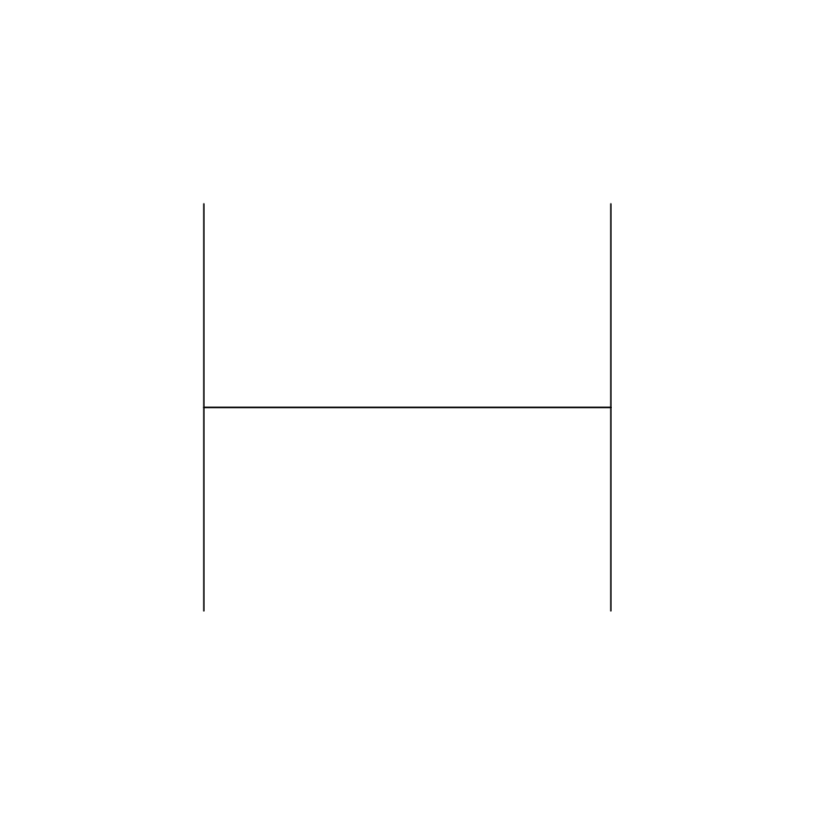
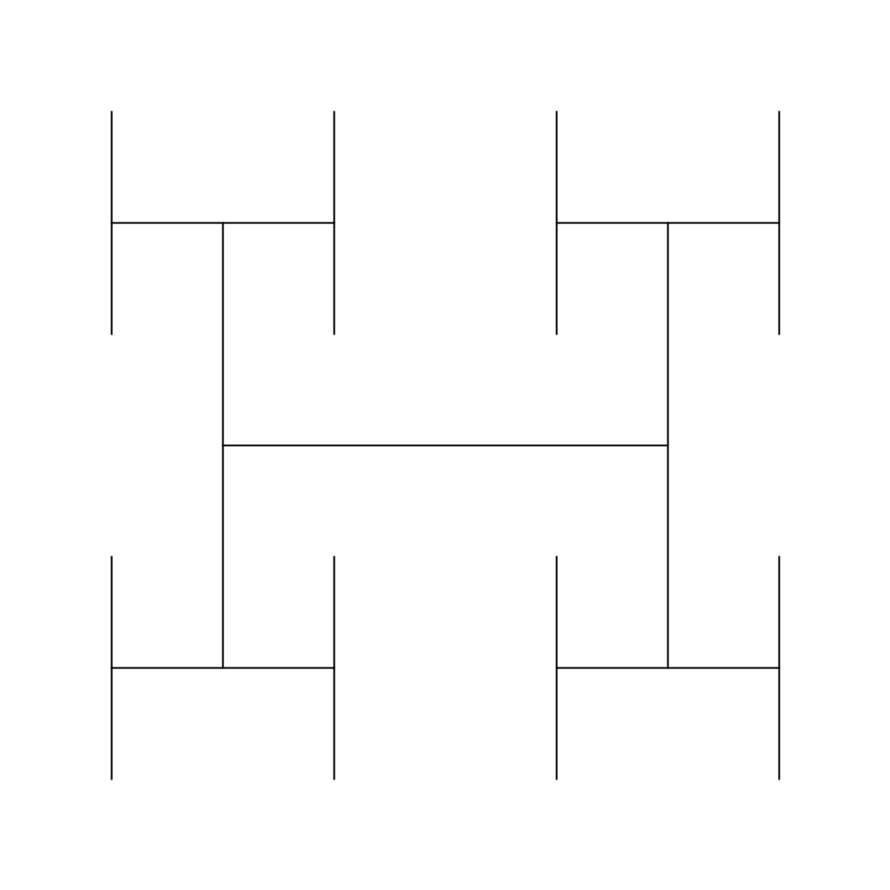
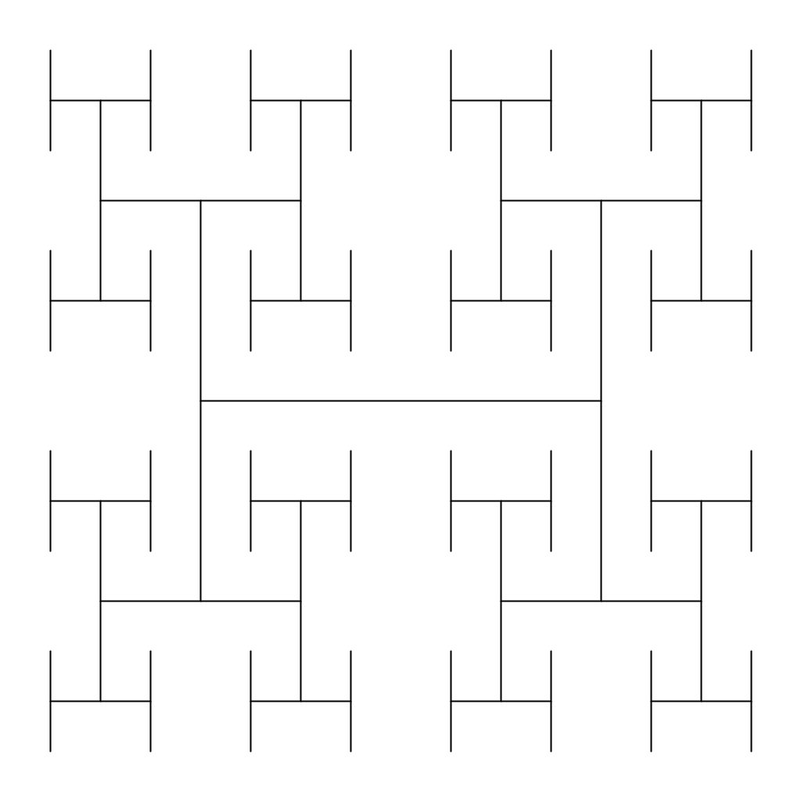
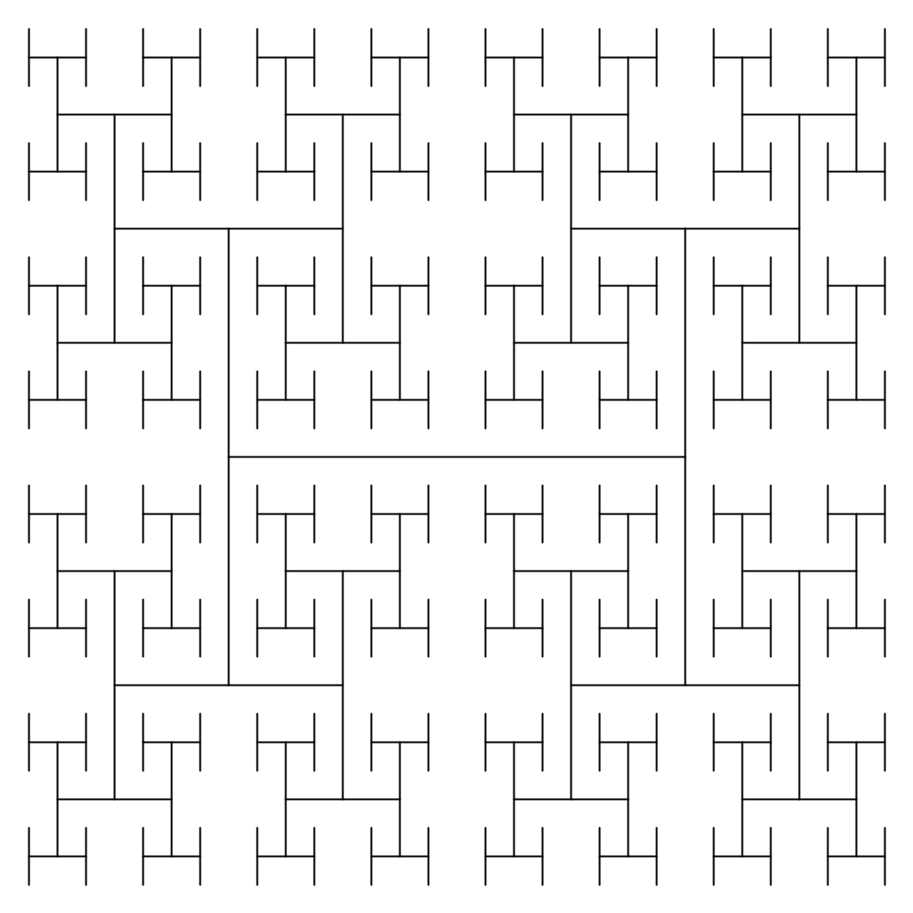
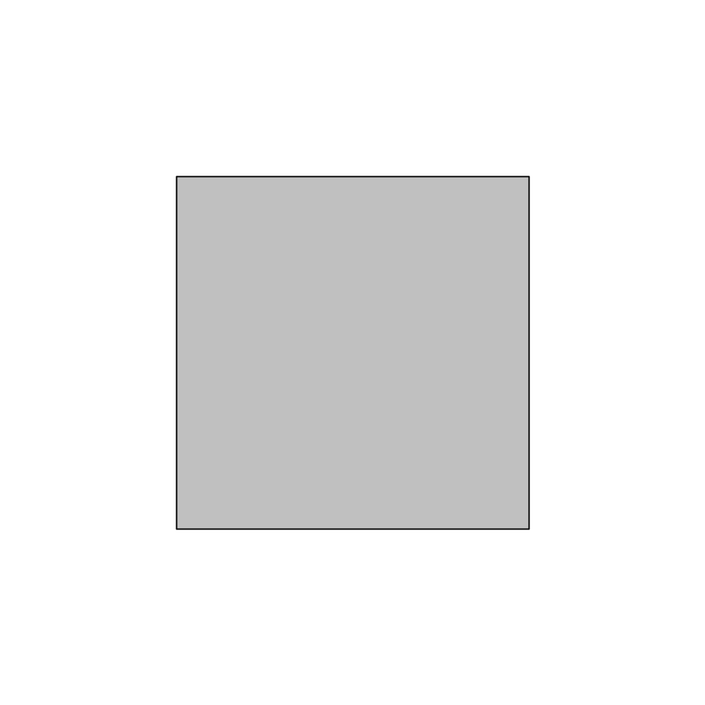
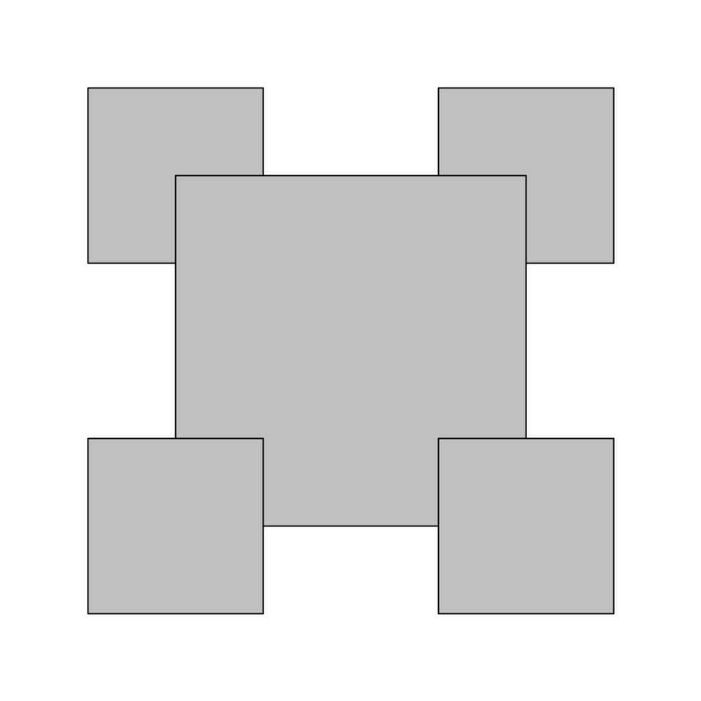
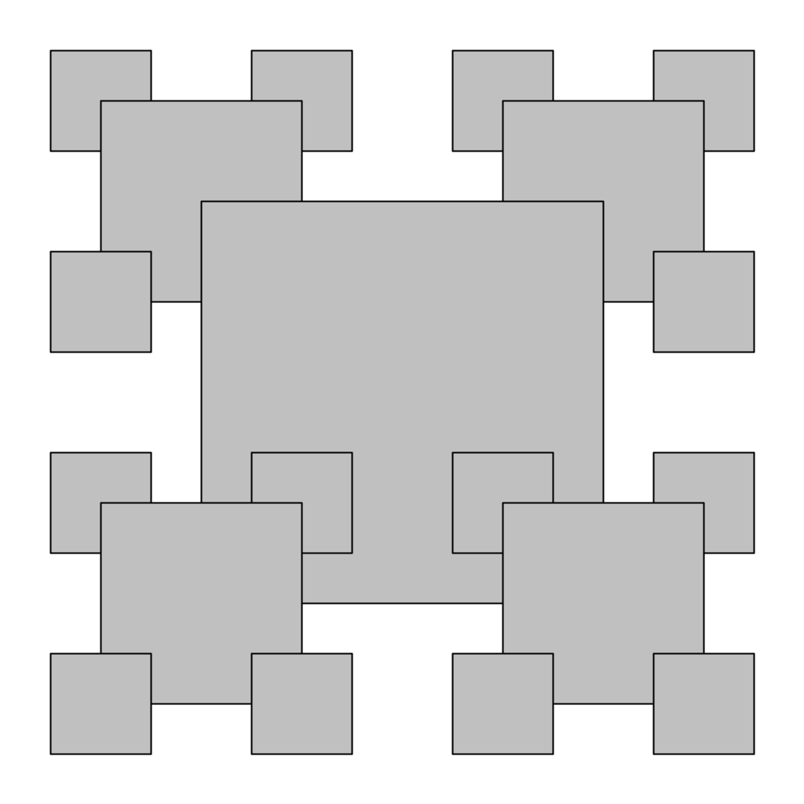
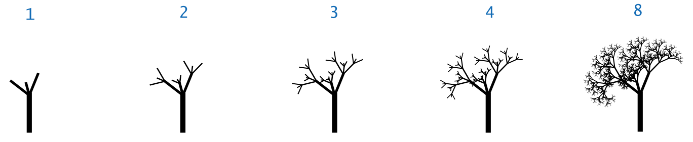
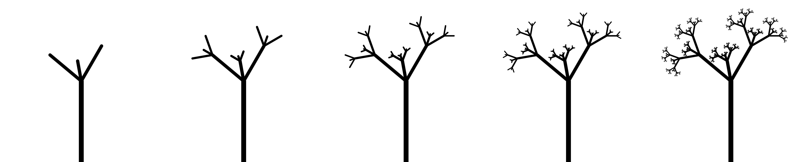

# Lesson 2.3b - Graphical Recursion

## HTree

Write a class `HTree` with a method
```
public static void draw(int n, double length, double x, double y)
```
that will draw an "H" shape centered at (`x`, `y`) with length `length`. It should also recursively draw `n-1` smaller "H" shapes centered at the four corners of the larger "H", and with half the length.

```
draw(1, 0.5, 0.5, 0.5);
```


```
draw(2, 0.5, 0.5, 0.5);
```


```
draw(3, 0.5, 0.5, 0.5);
```


```
draw(4, 0.5, 0.5, 0.5);
```


## RecursiveSquares

Write a class `RecursiveSquares` with a method

```
public static void draw(int n, double x, double y, double length)
```
that draws the recursive square pattern of order `n`, centered on (`x`, `y`) of side length `length`. 

```
draw(1, 0.5, 0.5, 0.5);
```


```
draw(2, 0.5, 0.5, 0.5);
```


```
draw(3, 0.5, 0.5, 0.5);
```


## Tree

Write a class `Tree` that makes drawings of trees with different levels of recursion. Try to reproduce Bob Sedgwick's images:



The best I could do are shown here:

